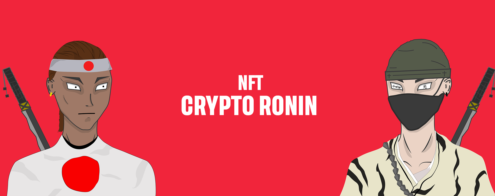

# Crypto Ronin

**Crypto Ronin** was a community-driven NFT collection that integrated learning, philanthropy, and art into an interactive virtual escapade.

---

## 🌕 Project Overview

Crypto Ronin was a limited series of **1,111 unique NFTs**, created to commemorate creativity, cooperation, and positive community influence. The project had the following goals:

- **Empower Newcomers**: Simplify the entry into the NFT world for beginners.
- **Give Back**: Auction a special charity NFT to support meaningful causes.
- **Build Community**: Host engaging events, meet‑ups, and giveaways.

---

## 🎨 The Collection

| Feature | Details |
| :--- | :--- |
| **Total Supply** | 1,111 Crypto Ronin NFTs |
| **Mint Price** | 10 MATIC per floor mint (whitelist price: 5 MATIC) |
| **Mint Limit** | Up to 20 per wallet, 5 per transaction |
| **Uniqueness** | Randomly generated from diverse traits |

---

## 🛠️ Tech Stack

- **Frontend**: HTML5, CSS3, JavaScript
- **Frameworks**: Bootstrap 5, Tailwind CSS
- **Animations**: AOS (Animate On Scroll), Kute.js, Animate.css
- **Blockchain Interaction**: Web3.js

---

## 📄 License

This project is licensed under the MIT License - see the [LICENSE](LICENSE) file for details.
